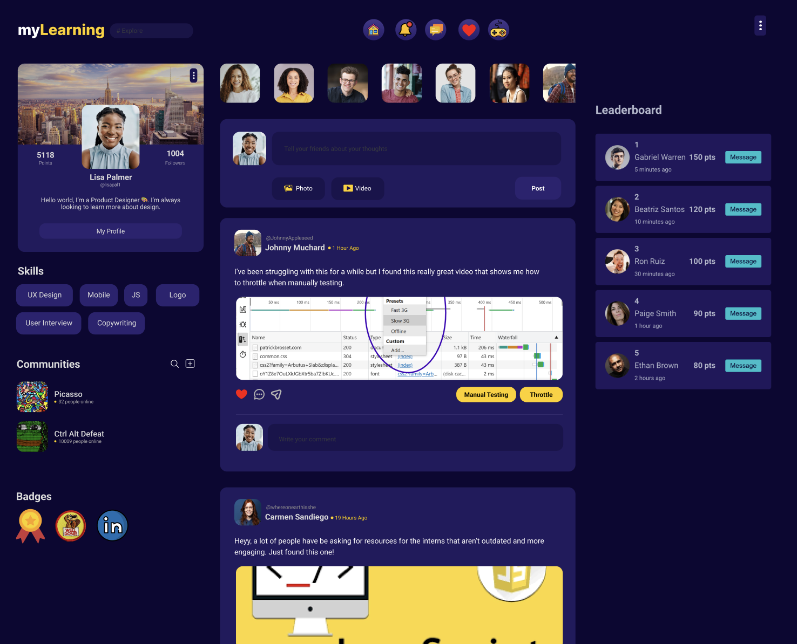
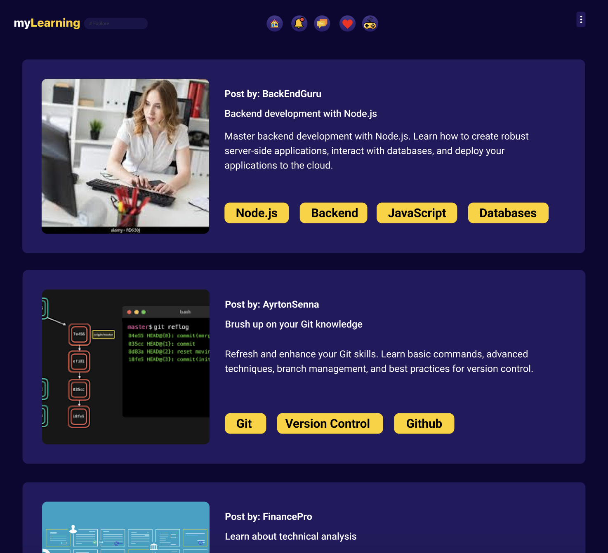

# 🗽📚 myLearning App

## Overview

myLearning  App is a platform designed to allow users to post and share useful resources. It helps to prevent valuable information from getting lost in an abyss by enabling keyword and filter-based searches. Additionally, the app features a ✨gamified experience✨ where users can like and share posts, with the most active contributors appearing on the leaderboard!
## Figma Design




## Features

- **Post Resources**: Users can post resources they've found helpful, along with keywords and filters for easy searching.
- **Keyword/Filter Search**: Easily search for posts using keywords and filters to find relevant resources quickly.
- **Gamification**: Users can like and share posts. Points are awarded for these activities, and top contributors are featured on the leaderboard.
- **User Profiles**: Each user has a profile displaying their posts, likes, and rank on the leaderboard.
- **Communities: There are bustling communities that are always sharing innovative findings, ideas, and solutions.

## Tech Stack

- **Frontend**: NextJS, React, Styled-components
- **Backend**: Node.js, Express.js
- **Database**: MongoDB
- **Styling**: CSS, Styled-components
- **Icons**: Font Awesome

## Installation

### Prerequisites

- Node.js
- npm (Node Package Manager)

### Steps

1. **Clone the Repository**

```sh
git clone [https://github.com/yourusername/resources-sharing-app.git](https://github.com/lmigtech/ctrl-alt-defeat-ui.git
cd ctrl-alt-defeat-ui
```

2. **Install Dependencies**

```sh
npm install
```
3. **Prepare the Application**

```sh
npm run build
```

4. **Start the Server**

```sh
npm start
```

The server will start on `http://localhost:3000`.

## Usage

1. **Register/Login**: Create an account or login if you already have one.
2. **Post a Resource**: Navigate to the "Post Resource" section, add your resource, and tag it with relevant keywords/filters.
3. **Search**: Use the search bar to find resources by keywords or filters.
4. **Like/Share**: Engage with posts by liking and sharing. Earn points to climb the leaderboard.
5. **Leaderboard**: Check the leaderboard to see the top contributors.

## Components

### `UserCard.jsx`

A card component to display user profiles, including their name, location, description, skills, and communities they are part of.

### `Page.js`

The main page layout that includes multiple columns and integrates the `UserCard` component.

## Application Structure

- **bamboo-specs/** - Your application's Bamboo pipeline-as-code.
- **deployment/** - Runtime-specific manifest and configuration files.
- **app/** 
  - **[...not_found]** - A catch-all route responsible for rendering 404s.
  - **components** - Non-layout specific components.
  - **health** - Health route which acts as healthcheck endpoint for our application.
  - **styles** - Global styles and CSS Reset.
  - **technologies** - Technologies route which showcases the different technologies used within our pattern.
- **e2e/** - Feature tests that ensure that the application is working as intended.
- **public/** - Non-bundled assets for your build (e.g. images).

## Running Your Application

### Local Development

During development, the `start-local` script can be used to watch source files for changes and restart the server on the fly. It will reload the server and browser any time a change is made to the code.

### Local Test Execution

This UI comes packaged with scripts that support unit and feature testing. In order to execute the pre-packaged tests, run the following commands:

- **Unit tests**: `test-unit`
- **Feature tests**: `test-e2e`

### Production Simulation

Code will be built and run in production with the `build` and `start` scripts. To simulate a run in a production environment, these scripts should be used.

### Deploying Your Application

The easiest way to deploy your application is documented on the [Architecture Guide](#).

### Finding the Deployed Application through CloudForge

Inside the CloudForge portals manage tab, select the application's organization and environment. You should see your deployed application and its URL listed.

## Monitoring

### Server-Side & Browser Monitoring with Datadog

To enable server-side monitoring in Datadog, which can be valuable for monitoring API endpoints & routes, review the [APM documentation](#). But if you want to monitor end user behavior, routes, & API calls made within the browser review the [Real User Monitoring (RUM) documentation](#).

## Vulnerability Scanning

`npm audit` is used to facilitate security scanning for Node packages used in Bamboo pipelines.

To run the security audit locally:
1. Make sure you have a `package-lock.json` file.
2. A `package-lock.json` file can be generated using the following command: `npm install --package-lock-only`
3. Run the `check-audit` script found in your `package.json`.

## Contributing

1. **Fork the Repository**
2. **Create a Feature Branch**

```sh
git checkout -b feature/new-feature
```

3. **Commit Your Changes**

```sh
git commit -m 'Add some new feature'
```

4. **Push to the Branch**

```sh
git push origin feature/new-feature
```

5. **Open a Pull Request**

## License

This project is licensed under the MIT License - see the [LICENSE](LICENSE) file for details.
  
